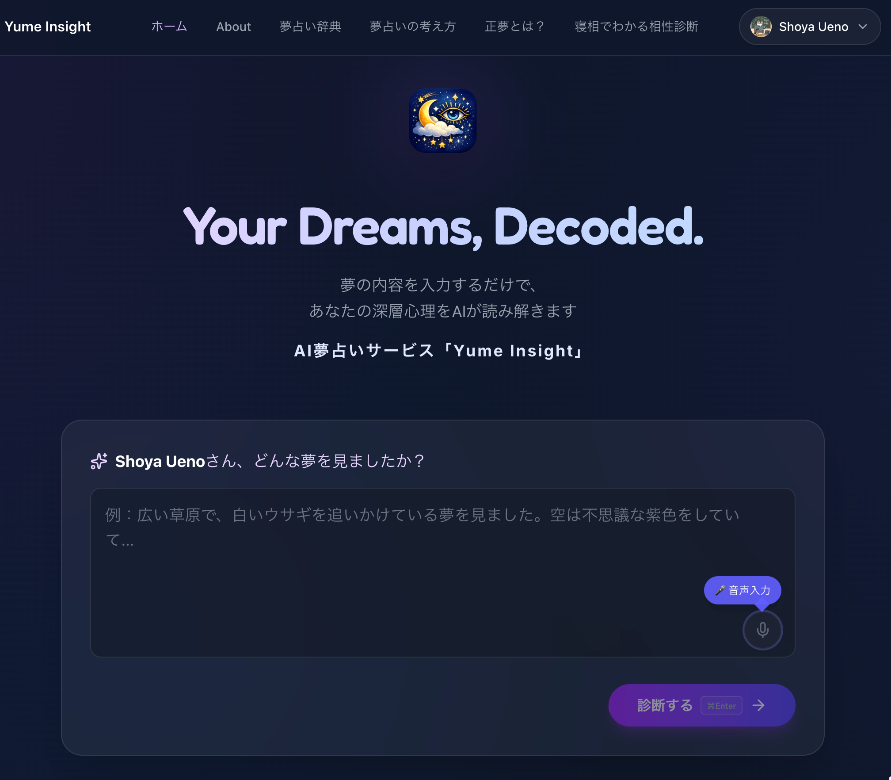

# 🌙 Yume Insight - AI 夢占いアプリ

AI（Google Gemini）を活用した、神秘的で心温まる夢占いアプリケーションです。
見た夢の内容を記録し、深層心理の分析やアドバイスを受け取ることができます。



## ✨ 特徴

- **AI 夢占い**: Google Gemini による高精度な夢分析
- **追加質問機能**: AIが夢の詳細を質問し、より精度の高い診断を実現
- **音声入力**: Web Speech API を使った日本語音声入力対応
- **夢占い辞典**: カテゴリ別のシンボル辞典（動物・自然・場所・行動・感情）
- **SNSシェア機能**: X（Twitter）シェア、URLコピー対応
- **ユーザー認証**: Supabase Auth による Google / メールアドレスログイン
- **夢日記（履歴保存）**: ログインユーザーは過去の診断結果をマイページからいつでも振り返れる
- **お問い合わせ機能**: バリデーション付きのコンタクトフォーム

## 🛠️ 技術スタック

- **Framework**: Next.js 15 (App Router)
- **AI**: Google Generative AI (Gemini API)
- **Database/Auth**: Supabase
- **Forms**: React Hook Form, Zod
- **Email**: Resend
- **Styling**: Tailwind CSS v4
- **UI Components**: shadcn/ui, Lucide React, React Icons
- **Toast**: Sonner

## 📁 プロジェクト構成

```
dream-analysis-app/
├── app/                    # Next.js App Router ページ
│   ├── api/analyze/        # 夢占い API エンドポイント
│   ├── dashboard/          # マイページ（夢の履歴）
│   ├── result/[id]/        # 診断結果ページ
│   ├── dictionary/         # 夢占い辞典
│   │   └── category/       # カテゴリ別辞典ページ
│   ├── approach/           # 診断アプローチの解説ページ
│   ├── about/              # サイト紹介ページ
│   ├── contact/            # お問い合わせページ
│   ├── privacy/            # プライバシーポリシー
│   ├── terms/              # 利用規約
│   └── auth/callback/      # 認証コールバック
├── components/             # 共通コンポーネント
│   ├── GradientBackground.tsx  # 共通グラデーション背景
│   ├── Header.tsx          # ヘッダー
│   ├── Footer.tsx          # フッター
│   ├── VoiceInput.tsx      # 音声入力コンポーネント
│   ├── ShareButtons.tsx    # SNSシェアボタン
│   ├── Logo.tsx            # ロゴコンポーネント
│   └── ui/                 # shadcn/ui コンポーネント
├── lib/                    # ユーティリティ・設定
│   ├── constants.ts        # 定数・プロンプトテンプレート
│   ├── types.ts            # 型定義
│   ├── utils.ts            # ユーティリティ関数
│   ├── supabase/           # Supabase クライアント
│   └── data/               # 夢占い辞典データ
├── supabase/               # Supabase設定
│   └── schema.sql          # データベーススキーマ
└── public/                 # 静的ファイル
```

## 🚀 セットアップ

### 1. リポジトリのクローン

```bash
git clone <repository-url>
cd dream-analysis-app
```

### 2. 依存関係のインストール

```bash
npm install
```

### 3. 環境変数の設定

`.env.local` を作成し、以下の項目を設定してください。

```env
# Google Gemini API Key
GEMINI_API_KEY=your_gemini_api_key

# Supabase Configuration
NEXT_PUBLIC_SUPABASE_URL=your_supabase_project_url
NEXT_PUBLIC_SUPABASE_ANON_KEY=your_supabase_anon_key

# Resend (Optional for contact form)
RESEND_API_KEY=your_resend_api_key
ADMIN_EMAIL=your_admin_email
```

### 4. データベースの準備

Supabase の SQL Editor で以下のテーブルを作成してください。

#### `dreams` テーブル
夢の診断結果を保存するために必要です。詳細は `supabase/schema.sql` を参照してください。
SNSシェア機能を有効にするために、匿名ユーザーのインサートとIDによる公開閲覧を許可する設定になっています。


#### `contacts` テーブル
お問い合わせ内容を保存するために必要です。
```sql
create table contacts (
  id uuid default gen_random_uuid() primary key,
  created_at timestamp with time zone default timezone('utc'::text, now()) not null,
  name text not null,
  email text not null,
  subject text not null,
  message text not null
);
```

### 5. ローカル開発サーバーの起動

```bash
npm run dev
```

## 📄 ライセンス

© 2026 Yume Insight. All rights reserved. Powered by Gemini.
