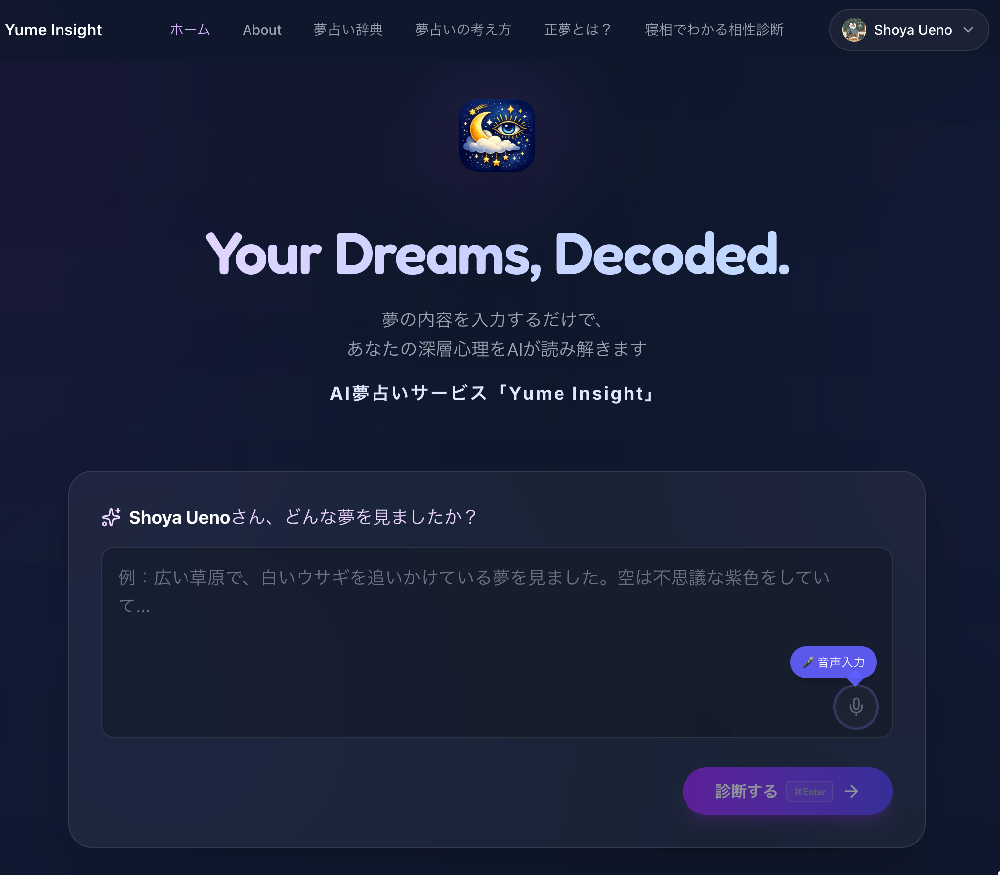

# 🌙 Yume Insight - AI 夢占いアプリ

AI（Google Gemini）を活用した、神秘的で心温まる夢占いアプリケーションです。
見た夢の内容を記録し、深層心理の分析やアドバイスを受け取ることができます。



## ✨ 特徴

- **AI 夢占い**: Google Gemini による高精度な夢分析
- **追加質問機能**: AIが夢の詳細を質問し、より精度の高い診断を実現
- **音声入力**: Web Speech API を使った日本語音声入力対応
- **夢占い辞典**: 100種類以上のシンボルを網羅したカテゴリ別辞典
- **解説コンテンツ**: 「正夢」や「寝相と心理」など、夢に関する興味深いコラム
- **SNSシェア機能**: X（Twitter）シェア、URLコピー対応（OGP画像生成対応）
- **ユーザー認証**: Supabase Auth による Google / メールアドレスログイン
- **夢日記（履歴保存）**: ログインユーザーは過去の診断結果をマイページからカレンダー形式で振り返れる
- **お問い合わせ機能**: バリデーション付きのコンタクトフォーム

## 🛠️ 技術スタック

- **Framework**: Next.js 15 (App Router)
- **AI**: Google Generative AI (Gemini API)
- **Database/Auth**: Supabase
- **Content**: MDX (next-mdx-remote)
- **Forms**: React Hook Form, Zod
- **Email**: Resend
- **Styling**: Tailwind CSS v4
- **UI Components**: shadcn/ui, Lucide React, React Icons
- **Toast**: Sonner

## 📁 プロジェクト構成

```
dream-analysis-app/
├── app/                    # Next.js App Router ページ
│   ├── api/analyze/        # 夢占い API エンドポイント
│   ├── dashboard/          # マイページ（夢の履歴・カレンダー）
│   ├── result/[id]/        # 診断結果ページ
│   ├── dictionary/         # 夢占い辞典
│   ├── column/             # 夢分析コラム（25記事＋一覧）
│   ├── sleeping-positions/ # 寝相の解説ページ
│   ├── approach/           # 診断アプローチの解説ページ
│   ├── about/              # サイト紹介ページ
│   ├── contact/            # お問い合わせページ
│   ├── settings/           # 設定（プロフィール）ページ
│   ├── privacy/            # プライバシーポリシー
│   ├── terms/              # 利用規約
│   └── auth/callback/      # 認証コールバック
├── components/             # 共通コンポーネント
│   ├── Header.tsx          # ヘッダー（ナビゲーション）
│   ├── Footer.tsx          # フッター
│   ├── VoiceInput.tsx      # 音声入力
│   ├── ShareButtons.tsx    # SNSシェア
│   ├── AdsenseAd.tsx       # Google Adsense 広告
│   ├── ArticleSchema.tsx   # Article 構造化データ
│   ├── FaqSchema.tsx       # FAQPage 構造化データ
│   ├── column/             # コラム記事の共通骨格（後述）
│   └── ui/                 # shadcn/ui コンポーネント
├── content/                # MDXコンテンツ
│   └── dictionary/         # 夢占い辞典の個別データ
├── lib/                    # ユーティリティ・設定
│   ├── constants.ts        # 定数・プロンプトテンプレート
│   ├── supabase/           # Supabase クライアント・SSR設定
│   ├── mdx.ts              # MDX取得用ユーティリティ
│   ├── seo.ts              # コラムの Metadata 生成
│   └── data/               # 辞書インデックス・コラムのレジストリ
├── supabase/               # Supabase設定
│   └── schema.sql          # データベーススキーマ
└── public/                 # 静的ファイル（画像・アイコン）
```

## 🧩 コラム記事の書き方

コラム記事（`app/column/<slug>/page.tsx`）は共通骨格 `components/column/ColumnArticleShell.tsx` に本文を差し込む形で書く。パンくず・ヒーロー・記事メタ・FAQ・参考文献・免責・関連コラム・CTA は骨格側が並べるため、ページは本文と差分データだけを持つ。

新しい記事を追加する手順:

1. `lib/data/columnArticles.ts` の `COLUMN_ARTICLES` に `slug` / `title` / `description` / `breadcrumbLabel` / `publishedAt` を追加する
2. `app/column/<slug>/page.tsx` を作り、`buildColumnMetadata('<slug>')` を `metadata` に設定する
3. `ColumnArticleShell` に本文を渡す。本文中の広告位置は `<InContentAd />` を置く

重要な制約:

- **`title` と `description` は `COLUMN_ARTICLES` だけを正とする。** ページ側に metadata をベタ書きすると `<title>` と Article 構造化データの `headline` が食い違う
- **FAQ は `faqs` 配列だけを正とする。** アコーディオン表示と FAQPage 構造化データを同じ配列から生成しているため、表示と構造化データが乖離しない

## 🖼️ 画像

画像はすべて `next/image` を経由させる。生の `` を使うと表示サイズと無関係な原寸を配信してしまい、LCP を悪化させる。例外は OAuth プロバイダが返すユーザーアバターのみ（任意ホストのため `remotePatterns` に載せられない。該当箇所に理由をコメントしてある）。

`public/` に画像を追加するときは、実寸を最大表示サイズの2倍程度に収めてから置く。

## 🚀 セットアップ

### 1. リポジトリのクローン

```bash
git clone <repository-url>
cd dream-analysis-app
```

### 2. 依存関係のインストール

```bash
npm install
```

### 3. 環境変数の設定

`.env.local` を作成し、以下の項目を設定してください。

```env
# Google Gemini API Key
GEMINI_API_KEY=your_gemini_api_key

# Supabase Configuration
NEXT_PUBLIC_SUPABASE_URL=your_supabase_project_url
NEXT_PUBLIC_SUPABASE_ANON_KEY=your_supabase_anon_key
SUPABASE_SERVICE_ROLE_KEY=your_supabase_service_role_key

# Resend (Optional for contact form)
RESEND_API_KEY=your_resend_api_key
ADMIN_EMAIL=your_admin_email

# Site Configuration
NEXT_PUBLIC_BASE_URL=http://localhost:3000

# AdSense Slot
NEXT_PUBLIC_ADSENSE_SLOT=6378422969
```

### 4. データベースの準備

Supabase の SQL Editor で以下のテーブルを作成してください。

#### `dreams` テーブル
夢の診断結果を保存するために必要です。詳細は `supabase/schema.sql` を参照してください。
SNSシェア機能を有効にするために、匿名ユーザーのインサートとIDによる公開閲覧を許可する設定になっています。


#### `contacts` テーブル
お問い合わせ内容を保存するために必要です。
```sql
create table contacts (
  id uuid default gen_random_uuid() primary key,
  created_at timestamp with time zone default timezone('utc'::text, now()) not null,
  name text not null,
  email text not null,
  subject text not null,
  message text not null
);
```

### 5. ローカル開発サーバーの起動

```bash
npm run dev
```

## 📄 ライセンス

© 2026 Yume Insight. All rights reserved. Powered by Gemini.
